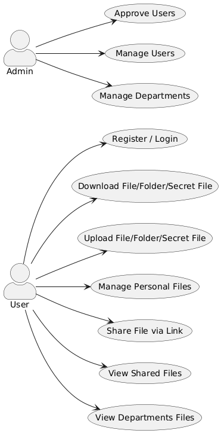
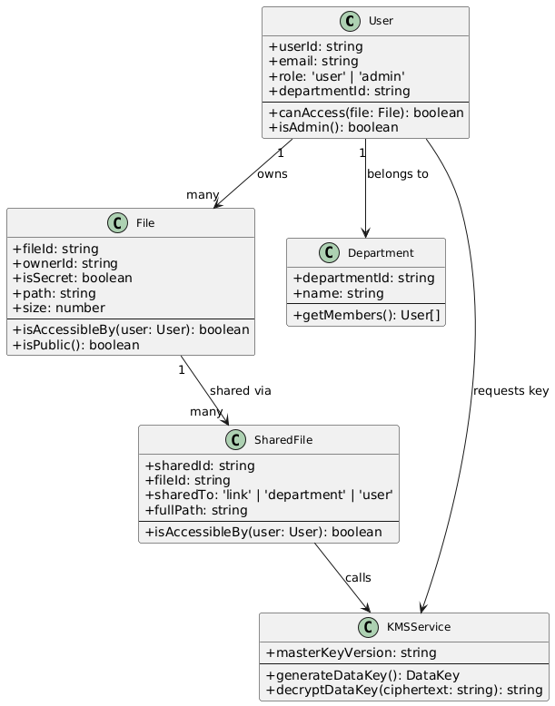

# Inspect Drive

> ระบบจัดเก็บและแชร์ไฟล์-โฟลเดอร์ สำหรับใช้งานภายในองค์กร
> ปลอดภัย ใช้งานง่าย รองรับการเข้ารหัสและควบคุมสิทธิ์การเข้าถึง

---

## ฟีเจอร์หลัก

- การอัปโหลด/ดาวน์โหลดไฟล์-โฟลเดอร์
- การเข้ารหัสไฟล์ลับ (Secret Files) โดยเรียกใช้ KMS แยกต่างหาก
- การจัดการไฟล์-โฟลเดอร์ Drag and drop เพื่อย้ายไฟล์-โฟลเดอร์ และลบไฟล์-โฟลเดอร์
- การแชร์ลิงก์ไฟล์-โฟลเดอร์แบบส่วนตัว, แผนก/กอง, สาธารณะ
- แสดงไฟล์-โฟลเดอร์ของแผนก/กอง ต่าง ๆ ที่แชร์ในหน้า `deptshare`
- ควบคุมสิทธิ์ตามบทบาท (User, Admin)
- ระบบจัดการผู้ใช้งาน อนุมัติผู้ใช้งาน, กำหนดโควต้าพื้นที่เก็บข้อมูล, แก้ไขข้อมูลผู้ใช้งาน, ลบผู้ใช้งาน
- ระบบจัดการแผนก/กอง เพิ่มแผนก/กอง, แก้ไขข้อมูลแผนก/กอง, ลบแผนก/กอง
- ระบบเก็บข้อมูล Log 90 วัน (Audit Log) ผ่าน Winston แยกไฟล์ info+ Log กับ Error Log

---

## โครงสร้างโปรเจกต์

| Path | รายละเอียด |
| --- | --- |
| `src/app` | หน้า UI หลัก + API Routes (Next.js App Router) |
| `src/components` | UI Components Navbar, Upload, Drive, Share |
| `src/models` | Mongoose Models: User, File, Department |
| `src/lib` | Utilities เช่น Database, Logging, Email, Password |
| `src/utils` | ฟังก์ชันย่อยสำหรับ UI เช่นไอคอนไฟล์ |
| `public/` | ไฟล์ Static เช่น Favicon, รูปภาพ |
| `private/uploads/` | ที่จัดเก็บข้อมูลที่อัปโหลด โดยแยกตาม `userId` |
| `logs/` | Audit Logs (Winston) |
| `.env.local` | ตัวแปรระบบ เช่น Mongo URI, KMS URL |
| `Dockerfile` | Docker config สำหรับ Inspect Drive |
| `docker-compose.yml` | กำหนดบริการ Inspect Drive + MongoDB |

---

## ฟีเจอร์/Use Cases

### User
- ลงทะเบียน / เข้าสู่ระบบ
- อัปโหลด / ดาวน์โหลด (รวมไฟล์ลับ)
- จัดการไฟล์-โฟลเดอร์ Drag and drop เพื่อย้ายไฟล์-โฟลเดอร์ และลบไฟล์-โฟลเดอร์
- แชร์ลิงก์ไฟล์-โฟลเดอร์แบบส่วนตัว, แผนก/กอง, สาธารณะ
- ดูไฟล์-โฟลเดอร์ของแผนก/กอง ต่าง ๆ ที่แชร์ในหน้า `deptshare`

### Admin
- อนุมัติผู้ใช้งานใหม่
- จัดการผู้ใช้งาน (กำหนดโควต้าพื้นที่เก็บข้อมูล, แก้ไขข้อมูลผู้ใช้งาน, ลบผู้ใช้งาน)
- จัดการแผนกหรือกอง (เพิ่มแผนกหรือกอง, แก้ไขข้อมูลแผนกหรือกอง, ลบแผนกหรือกอง)

### Use Case Diagram


---

## Class Diagram

ระบบประกอบด้วย Entity หลัก ได้แก่: `User`, `File`, `SharedFile`, `Department`, และ `KMSService`



---

## Workflow

1. User ใหม่ลงทะเบียนผ่านหน้า /register
2. Admin ตรวจสอบและอนุมัติผ่าน /manage/users
3. User สามารถอัปโหลด/ดาวน์โหลด, จัดการไฟล์-โฟลเดอร์ตัวเอง, แชร์ไฟล์-โฟลเดอร์, ดูไฟล์-โฟลเดอร์ของแผนก/กอง ต่าง ๆ ที่มีสิทธิ์การเข้าถึง
4. หากเป็น Secret File จะเรียก `/keys/generate` จาก KMS เพื่อเข้ารหัสไฟล์
5. Admin สามารถดูสรุปโควต้าพื้นที่ใช้งานทั้งหมด + บริหารจัดการได้จากหน้า /manage/users

---

## การติดตั้ง (Dev/Local)

### ขั้นตอนเบื้องต้น
1. ติดตั้ง `Node.js v20+`, `Docker`, `Docker Compose`
2. คัดลอก `.env.local.example` ไปเป็น `.env.local` และตั้งค่าเช่น:

```env
MONGODB_URI=mongodb://mongodb:27017/inspect-drive
KMS_URL=http://localhost:4000
NEXTAUTH_SECRET=xxxxxxxx
```

### รันระบบ

```bash
docker-compose up --build
```

## URLs

| URL | หน้าที่ |
| --- | --- |
| `http://localhost:3000` | Inspect Drive (Frontend + API) |
| `http://localhost:4000` | KMS Service (Key Management) |

---

## โครงสร้าง API

| Endpoint | Method | รายละเอียด |
| --- | --- | --- |
| `/api/files/upload` | POST | อัปโหลดไฟล์-โฟลเดอร์ |
| `/api/files/download` | GET | ดาวน์โหลดไฟล์-โฟลเดอร์ |
| `/api/files/upload-secret` | POST | อัปโหลดไฟล์ลับ |
| `/api/share` | POST / GET | แชร์ไฟล์-โฟลเดอร์, ดูลิงก์ |
| `/api/users` | GET / PUT / DELETE | จัดการผู้ใช้งาน |
| `/api/departments` | GET / POST | จัดการแผนกหรือกอง |
| `/api/quota` | GET | ดูโควต้าพื้นที่เก็บข้อมูล |
| `kms-service/keys/generate` | POST | สร้าง Key เข้ารหัส |
| `kms-service/keys/decrypt` | POST | ถอดรหัส Key |

---

## Secret File Encryption

- ใช้ AES-GCM + Metadata เช่น `version`
- DataKey สร้างจาก KMS
- Key ไม่ถูกบันทึกลง Log (`lib/logger.ts` ใช้ Masking)
- ถอดรหัสผ่าน `/keys/decrypt`

```ts
POST /api/files/upload-secret
Body: FormData (field: file)
```

```ts
POST http://localhost:4000/keys/generate
```

---

## การทดสอบ

เฉพาะ `kms-service` ใช้ E2E test ผ่าน Supertest:

```bash
cd kms-service
npm run test:e2e
```

---

## เทคโนโลยีที่ใช้

| Category | Tools |
| --- | --- |
| Frontend | React / Next.js |
| Backend | Next.js API, NestJS |
| Auth | NextAuth.js |
| Database | MongoDB |
| Logger | Winston, Daily Rotate |
| Containerization | Docker, Docker Compose |

---

## ผู้พัฒนา

**พ.อ.ท.อภิศักดิ์ แซ่ลิ้ม**

---

## License

This project is **proprietary** and intended for internal organizational use only.